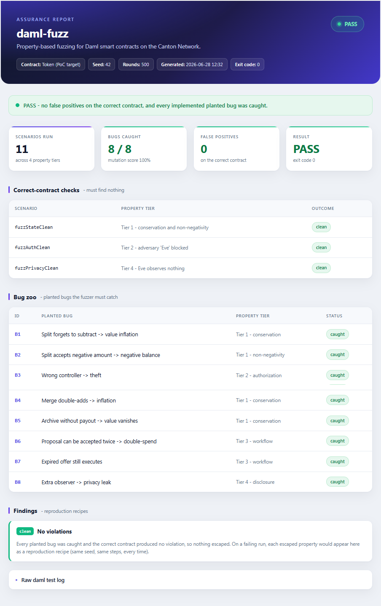

# daml-fuzz

Property-based fuzzing for Daml smart contracts on the Canton Network.

You declare the invariants your contract must never break. daml-fuzz generates
large numbers of randomized, multi-party transaction sequences, checks the
invariants after every step, and reports any sequence that violates one together
with a deterministic recipe to reproduce it.

**License:** Apache-2.0 · **Daml:** 3.x · **Status:** proof of concept



*The self-contained HTML report produced by every run (`scripts/report.ps1`).*

## Why

Canton carries regulated, institutional value, and the expensive bugs in Daml
are rarely in a single choice. They emerge from combinations of parties, steps,
and orderings that no hand-written test enumerates. The ecosystem already has
coverage analysis and static checking, but nothing that *generates adversarial
inputs*. daml-fuzz targets the failure modes specific to Canton:

- **Conservation of value** — value is never created from nothing or lost.
- **Authorization** — a party can never take an action it is not entitled to.
- **Privacy / disclosure** — a party can never observe data it is not a
  stakeholder of. (This class cannot be expressed on transparent ledgers.)

## Features

- Four property classes out of the box: value (conservation & non-negativity),
  authorization, multi-step workflow, and privacy.
- Mutation-tested. A "bug zoo" of contracts with known planted defects measures
  detection. The current proof of concept catches **8 of 8** planted bugs with
  **0 false positives** on the correct contract.
- Deterministic. A fixed seed reproduces a run exactly. No network, no external
  services, no per-run cost.
- A self-contained HTML report suitable for archiving as an assurance artifact.

## Quick start

Install the Daml SDK (3.x) — see [docs/02](docs/02-install-the-sdk-and-run.md).
Then, from the project root:

```bash
daml test
```

All scenarios are written so that a green run means the fuzzer behaved correctly:
no false alarms on the correct contract, and every planted bug caught.

Headline metrics:

```bash
./scripts/scorecard.ps1
```

```
MUTATION SCORE : 8 / 8 planted bugs caught (100%)
FALSE POSITIVES: 0
CHOICE COVERAGE: 10 / 23 choices exercised (43.5%)
RESULT: PASS
```

A self-contained report:

```bash
./scripts/report.ps1   # writes report.html
```

## How it works

1. You declare invariants (the rules) separately from any single contract.
2. A seeded generator produces randomized multi-party transaction sequences.
3. After each step the invariants are evaluated against ledger state.
4. On a violation the run stops and reports the property that broke, the choice
   involved, and the exact sequence of steps to reproduce it.

Because the generator is seeded, every finding is fully reproducible.

## Roadmap

- Read a compiled package and fuzz it with no manual setup.
- Guided generation that reaches deep, rare contract states.
- Automatic shrinking of a failing sequence to its minimal form.
- A GitHub Action that fuzzes every pull request.
- Deeper privacy/disclosure analysis.

## Project layout

```
daml/        contracts and the fuzzer (Token, Fuzz, Properties, Prng, Mutants/)
docs/        guides, from a gentle introduction to the design
scripts/     scorecard.ps1 and report.ps1
proposals/   the daml-fuzz development-fund proposal
```

## Documentation

- [Introduction to Canton and Daml](docs/01-what-is-canton-and-daml.md)
- [Install and run](docs/02-install-the-sdk-and-run.md)
- [The token contract](docs/03-understanding-the-token-contract.md)
- [The fuzzer](docs/04-understanding-the-fuzzer.md)
- [The bug zoo and scorecard](docs/05-the-bug-zoo-and-scorecard.md)
- [Glossary](docs/07-glossary.md)

## License

Apache-2.0.
